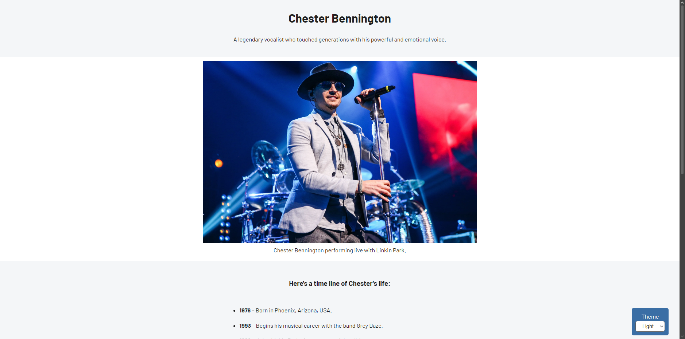

# 2. Build a Tribute Page - Personalized Version

**Repository**: [github.com/fabiohtoledo/build-a-tribute-page](https://github.com/fabiohtoledo/build-a-tribute-page)  
**Live Demo**: [https://fabiohtoledo.github.io/build-a-tribute-page](https://fabiohtoledo.github.io/build-a-tribute-page)

---

## 📑 Table of Contents

- [🇺🇸 English](#-build-a-tribute-page-english)
  - [Screenshot](#screenshot)
  - [📋 About the Project](#-about-the-project)
  - [📝 What the freeCodeCamp Project Required](#-what-the-freecodecamp-project-required)
  - [✨ Additional Features (Added Later)](#-additional-features-added-later)
  - [🚀 Features](#-features)
  - [🛠️ Technologies & Concepts Used](#️-technologies--concepts-used)
  - [🧠 What I Learned](#-what-i-learned)

- [🇧🇷 Português](#-construa-uma-página-de-tributo-português)
  - [📋 Sobre o Projeto](#-sobre-o-projeto)
  - [📝 O Que o Projeto do freeCodeCamp Pedia](#-o-que-o-projeto-do-freecodecamp-pedia)
  - [✨ Funcionalidades Adicionais (Adicionadas Depois)](#-funcionalidades-adicionais-adicionadas-depois)
  - [🚀 Funcionalidades](#-funcionalidades)
  - [🛠️ Tecnologias & Conceitos Utilizados](#️-tecnologias--conceitos-utilizados)
  - [🧠 Aprendizados](#-aprendizados)

- [✍️ Author / Autor](#️-author--autor)

---

# 🇺🇸 Build a Tribute Page (English)

**Chester Bennington Tribute Page** – A responsive tribute page honoring the life and legacy of Chester Bennington, built for the freeCodeCamp certification project.

[**Live Demo / Project Link**](https://fabiohtoledo.github.io/build-a-tribute-page)
### Screenshot

## 📋 About the Project
This project is a tribute page dedicated to Chester Bennington, the iconic vocalist of Linkin Park. It was developed as part of the freeCodeCamp "Build a Tribute Page" certification project. The page presents a timeline of his life, significant career milestones, and powerful quotes that reflect his struggles and legacy.

[**freeCodeCamp – Build a Tribute Page**](https://www.freecodecamp.org/learn/2022/responsive-web-design/build-a-tribute-page-project/build-a-tribute-page)

### 📝 What the freeCodeCamp Project Required
- A main container that wraps all content
- A title describing who the tribute is for
- A container holding an image and its caption
- An image that scales properly on different screens and stays centered
- A section with detailed information about the person
- An external link opening in a new tab for further reading
- All the essential structure to pass the certification tests

### ✨ Additional Features (Added Later)
After completing the base requirements, I revisited the project and added:

- **Theme Switcher** – Fixed select dropdown that toggles between Light, Dark, and Vintage color schemes using CSS custom properties
- **Expanded Content** – Additional sections about mental health awareness and Chester's legacy
- **More Quotes** – Multiple meaningful quotes highlighting his impact beyond music
- **Enhanced Styling** – Refined typography, spacing, and hover effects
- **Improved Responsiveness** – Better layout adaptation for different screen sizes

## 🚀 Features
- Fully responsive design
- Theme switcher with 3 color schemes (Light, Dark, Vintage)
- Timeline of Chester's life and career
- Legacy section focused on mental health awareness
- Collection of meaningful quotes
- Accessible markup following freeCodeCamp requirements

## 🛠️ Technologies & Concepts Used
- **HTML5** – Semantic structure, figure/figcaption, main element
- **CSS3** – Flexbox, CSS Custom Properties (variables), media queries
- **Google Fonts** – Barlow font family
- **Theme Switching** – Dynamic class toggling with CSS variables
- **Responsive Design** – Mobile-first approach with max-width and auto height for images
- **Positioning** – Fixed position for theme switcher

## 🧠 What I Learned
- Reinforced understanding of freeCodeCamp user stories and test requirements
- Practiced creating accessible tribute pages with proper semantic HTML
- Implemented a theme switcher using CSS custom properties and JavaScript
- Explored mental health awareness topics through content selection
- Learned to balance required features with creative enhancements
- Improved skills in responsive image handling and centering techniques

---

# 🇧🇷 Construa uma página de Tributo (Português)

**Página de Tributo ao Chester Bennington** – Uma página de tributo responsiva em homenagem à vida e legado de Chester Bennington, desenvolvida para o projeto de certificação do freeCodeCamp.

[**Link do Projeto / Demo**](https://fabiohtoledo.github.io/build-a-tribute-page)

## 📋 Sobre o Projeto
Este projeto é uma página de tributo dedicada a Chester Bennington, o icônico vocalista do Linkin Park. Foi desenvolvido como parte do projeto de certificação "Build a Tribute Page" do freeCodeCamp. A página apresenta uma linha do tempo de sua vida, marcos importantes da carreira e citações poderosas que refletem suas lutas e legado.

[**freeCodeCamp – Construa uma Página de Tributo**](https://www.freecodecamp.org/portuguese/learn/2022/responsive-web-design/build-a-tribute-page-project/build-a-tribute-page)

### 📝 O Que o Projeto do freeCodeCamp Pedia
- Um contêiner principal envolvendo todo o conteúdo
- Um título identificando a pessoa homenageada
- Um espaço dedicado para imagem com sua respectiva legenda
- Uma imagem que se adapta a diferentes telas e permanece centralizada
- Uma seção contando a história e trajetória do homenageado
- Um link externo para mais informações, abrindo em nova aba
- Toda a estrutura necessária para passar nos testes da certificação

### ✨ Funcionalidades Adicionais (Adicionadas Depois)
Após concluir os requisitos básicos, revisitei o projeto e adicionei:

- **Seletor de Tema** – Dropdown fixo que alterna entre esquemas de cores Light, Dark e Vintage usando variáveis CSS
- **Conteúdo Expandido** – Seções adicionais sobre conscientização de saúde mental e o legado de Chester
- **Mais Citações** – Diversas citações significativas destacando seu impacto além da música
- **Estilização Aprimorada** – Tipografia refinada, espaçamento e efeitos de hover
- **Responsividade Melhorada** – Melhor adaptação do layout para diferentes tamanhos de tela

## 🚀 Funcionalidades
- Design totalmente responsivo
- Seletor de tema com 3 esquemas de cores (Light, Dark, Vintage)
- Linha do tempo da vida e carreira de Chester
- Seção de legado focada em conscientização sobre saúde mental
- Coleção de citações significativas
- Marcação acessível seguindo os requisitos do freeCodeCamp

## 🛠️ Tecnologias & Conceitos Utilizados
- **HTML5** – Estrutura semântica, figure/figcaption, elemento main
- **CSS3** – Flexbox, propriedades personalizadas (variáveis CSS), media queries
- **Google Fonts** – Família de fontes Barlow
- **Troca de Tema** – Alternância dinâmica de classes com variáveis CSS
- **Design Responsivo** – Abordagem mobile-first com max-width e altura automática para imagens
- **Posicionamento** – Posição fixa para o seletor de tema

## 🧠 Aprendizados
- Reforcei o entendimento das user stories e requisitos de teste do freeCodeCamp
- Pratiquei a criação de páginas de tributo acessíveis com HTML semântico adequado
- Implementei um seletor de tema usando propriedades personalizadas CSS e JavaScript
- Explorei tópicos de conscientização sobre saúde mental através da seleção de conteúdo
- Aprendi a equilibrar recursos obrigatórios com melhorias criativas
- Melhorei habilidades em manipulação responsiva de imagens e técnicas de centralização

---

## ✍️ Author / Autor
**Fábio Henrique de Toledo**

---

*Project developed as part of the freeCodeCamp Responsive Web Design Certification.*  
*Projeto desenvolvido como parte da certificação "Responsive Web Design" do freeCodeCamp.*

